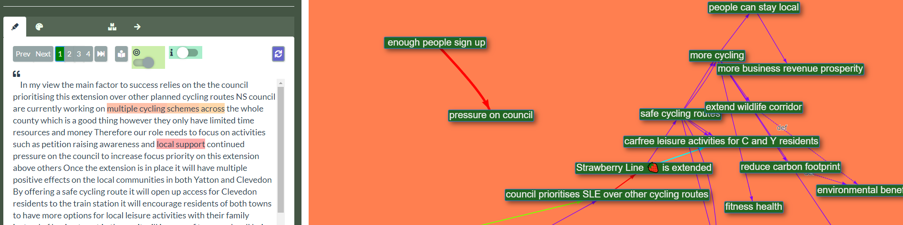

## What is **causalmap.app**?

It’s a new online research tool, a way to code, analyse and visualise fragments of information about what causes what.

- social science researchers and students use it to make sense of what interviewees tell them
- programme evaluators use it to visualise stakeholders’ experiences of how a programme is working and agree on a shared ‘theory of change’

## Why is **causalmap.app** different?

Other qualitative research software is designed to tag, organise and understand qualitative data. **causalmap.app** offers something different; it is designed to enable you to tag, organise, understand and present information about *what causes what*, from interviewees or other sources, as a causal network. 

With **causalmap.app**, you can:

- view narrative data 
- **highlight interviewees’ causal claims** and associate them with arrows between items
- automatically combine & display the multiple claims as a **causal map**
- **filter** and **disaggregate** claims by respondent characteristic and theme

## What problems can **causalmap.app** help solve?

### Social research

When people talk and write, they often give us rich information about what they think causes what. Students and researchers want to extract this rich information from texts e.g. interview transcripts. They can use **causalmap.app** to identify and highlight this information about what causes what, within the text.

### Programme evaluation

Professional evaluators and programme staff collect stories of change from stakeholders on the ground; they can use **causalmap.app** to understand, aggregate and present these testimonies.

## Who is behind the **causal map app**?

[Steve Powell](http://www.pogol.net/steve) is working with Fiona [Remnant](https://bathsdr.org/about-bathsdr/our-team/) from Bath SDR Ltd and [James Copestake](https://researchportal.bath.ac.uk/en/persons/james-copestake) at the University of [Bath](https://bathsdr.org/) to bring causalmap.app to life. It will provide an accessible coding and analysis solution for users of [QuIP](https://www.developmentbookshelf.com/doi/book/10.3362/9781780447469), but is a standalone product designed to be used by any researchers interested in causal connections.

## When will **causalmap.app be available**?

We’re in a pre-alpha testing stage and will be looking for beta testers in 2020. Contact us if you are interested: steve@pogol.net.

 

## Theoretical background

Lots more detail below for anyone interested in our theoretical musings, but in brief, a causal map is a directed graph which is intended to model causal relationships, in which the items (nodes, elements) are linked by arrows which mean that the item at the start of the arrow causally influences the item at the end of the arrow. This is a broad definition which covers many different existing “paradigms” of causal modelling. In general, the individual causal connections in a causal map may be based on information from more than one source. This will sound familiar to anyone who has read about or used the Qualitative Impact Protocol - QuIP - with its emphasis on causation and attribution. Indeed, **causalmap.app** could be defined as a daughter of QuIP, developed and nurtured with the benefit of the real-world experience derived from Bath SDR’s work on QuIP, but designed to flourish in a much broader context. 

**causalmap.app** is a tool which helps social scientists and programme evaluators to extract causal claims from texts (e.g. interview data) from different sources, and to combine and present it visually.

### Isn’t causation a bit of a taboo?

Gone are the days when we could think of data or information as primarily about *numbers*. Many of us who are involved in understanding the social world and evaluating interventions within it spend much of our day understanding, presenting, manipulating and caring about *causal structures* (and even *models of other people’s* causal structures).

The fundamental, radical points are these:

- **Causal information is primary information**. It isn’t something which exists only virtually as a potential conclusion on the basis of observations of non-causal variables. There is a fact of the matter about what causes what, just as there is a fact of the matter about the number of people on a training course.
- Parallel to that, **humans’ perception of causation is primary**, as primary (and fallible) as our perception, say, of colour. All the things which we know, or think we know, about our world – from the [colour of that dress](https://en.wikipedia.org/wiki/The_dress) to the way the wind shakes the trees – have already been through a lot of cognitive processing, and none of it is “secondary”. So, when we ask stakeholders the “why question” (what causes what in this domain), we are not asking them, first and foremost, about what they deduce from their (non-causal) observations in the way we might as scientists or researchers. That would be a very shaky method. No, we are asking them about what causes what based on their underlying understanding of the causal structure of their world, which they have pieced together in a number of different ways.

**causalmap.app** helps you work directly with stakeholders’ causal claims rather than, for example, looking for correlations between variables. Stakeholders’ causal claims are of course very far from being infallible sources of information about how their part of the world really works; but they probably know a lot more than “we the scientists” do. Regardless, their causal claims are valuable information **in their own right**: it is often important to know what stakeholders *believe or perceive to be true*, regardless of whether it is true.

As James Copestake [says](https://developmentbookshop.com/attributing-development-impact)[[1\]](#_ftn1) :

”..… attribution claims underpinning the QuIP do not require a control group, nor indeed variation in exposure to the intervention across the sample of respondents interviewed. Rather, causal claims rely on the integrity of ‘within-case’ statements made by respondents themselves”.

### What is a causal map?

A causal map is a directed graph which is intended to model causal relationships, in which the items (nodes, elements) are linked by arrows; the map is interpreted to mean that the items at the start of the arrows causally influence the items at the end of the arrows.

Many kinds of diagram already in use by social scientists and programme evaluators come under this heading. For example, different, overlapping *paradigms* and *use cases* for different kinds of causal map:

- Theories of Change for a project or programme, even (in a very restricted sense) Logical Frameworks
- Programme theories in theory-based evaluation
- Fuzzy Cognitive Maps
- Systems Diagrams
- DAGs, as promoted by Judea Pearl
- Structural Equation Models
- Diagrams used in Realist Evaluation and sometimes Outcome Harvesting
- (Comparative) Cognitive/Causal Mapping in the narrower sense
- [Causal diagrams](https://bathsdr.org/about-the-quip/coding-and-visualisation/) as constructed in QuIP studies

These approaches differ in many ways, primarily in the way in which the arrows are interpreted: what precise flavour of causation is meant? Each has its own, more or less explicit, syntactic and semantic rules, from which is it possible to make deductions. For example, if we know that

> X completely determines Y

and

> Y completely determines Z

we can usually deduce

> X completely determines Z

… but the kinds of inferences we can make may differ between the different causal map paradigms.

#### Modularity: maps are built up from generic elements

Causal maps are built up from generic atomic elements. Causal map paradigms tell us first what the individual elements mean (e.g. an arrow between X and Y means “X causes Y”) and then how to understand a composite map constructed from these elements. So, we probably wouldn’t call a Logframe a “causal map”, not least because the elements are not generic, they have a specific structure and role (outcomes, inputs etc).

### What is a causal *multi-map*?

In the approaches listed above, the information underlying them can usually be considered to come from just one source: one book, or one experiment, or one survey, or one expert; or the question “what is the source for that” isn’t even raised at all. We can call these kinds of maps ‘causal *mono-maps*’.

A causal *multi-map*, on the other hand, is a more general kind of causal map; a *list* or a *database* of fragments of causal information, in which information about the source is firmly attached to each fragment and taken very seriously.

If the homoeopath tells us that the right potency of gold is a cause of a well-functioning liver, and the doctor tells us that a well-functioning liver is a cause of clean blood, does that mean we know that the right potency of gold is a cause of clean blood? No, we can’t necessarily deduce from:

> H believes that X causally influences Y

plus

> D believes that Y causally influences Z

to

> X causally influences Z

… and we can’t even necessarily deduce this:

> Some people believe that X causally influences Z

There are lots of similar challenges in joining together fragments of causal information. If a reliable source tells us they are almost certain that the link between X and Y is strong, whereas a hundred less reliable sources tell us they believe that there is no such link, how do we combine that information?

Is there a plausible set of rules for amalgamating fragments of causal information? Can those rules be adapted to cope with the different kinds of paradigms mentioned above? We haven’t found many formal approaches to this solve this problem directly[[2\]](#_ftn2).

There are already many approaches (and software tools) for dealing with causal maps as described above. What is exciting about *causal mapping* is that it explicitly opens the possibility that this causal information comes from different sources and explicitly opens the challenge of how to meaningfully aggregate that information.

### causalmap.app as a response to these challenges

#### Approaches to aggregation

**causalmap.app** incorporates some of our own suggestions for aggregating and presenting causal link data, varying from the most conservative, in which the individual causal claims are left almost “as-is”, to powerful ways of summarising them.

#### Text highlighting

The app can import ‘ready-made’ causal fragments already encoded as sets of links between nodes and provided in a spreadsheet format. However, users would usually not yet have those links; they only have textual data, e.g. from a series of interviews. causalmap.app incorporates the kind of text-highlighting familiar from other social science tools, but rather than focusing on identifying things in the way traditional qualitative coding approaches do – concepts, phenomena – the causal map app also helps researchers to identify the **causal links** between those things. Instead of merely associating a section of text with a *category*, you associate it with a *link* between two (or more) causal factors. In this way, the app supports users with all the steps from raw text data to a finished, aggregated map - with an easy coding interface in between.

## Using causalmap.app

The software is in development so whilst we’d love to show you some images, they would be out of date before we even refreshed this website. But if you’re interested in seeing more or testing the app out, please contact us via [steve@pogol.net](mailto:steve@pogol.net)

 

------

[[1\]](#_ftnref1) Copestake, J., Morsink, M., & Remnant, F. (2019). *Attributing Development Impact: The Qualitative Impact Protocol case book*. Practical Action Publishing.

[[2\]](#_ftnref2) But, see for example Markiczy, L., & Goldberg, J. (1995). A method for eliciting and comparing causal maps. *Journal of Management*, *21*(2), 305–333.

 