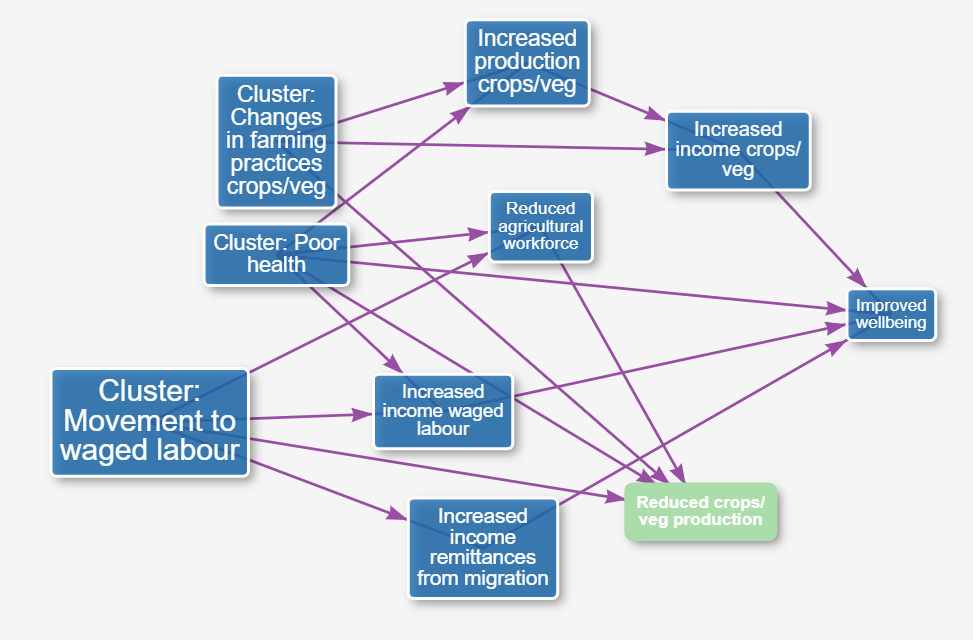

# What is the **causal map app**?

It's a new online research tool, a way to code, analyse and visualise fragments of information about what causes what.

- social science researchers and students use it to make sense of what interviewees tell them

- programme evaluators use it to visualise stakeholders' claims about how a programme works and create collective "theories of change"

# Who can use the **causal map app**?

We're in a pre-alpha testing stage. Contact us if you are interested: steve@pogol.net.

# Who is behind the **causal map app**?

[Bath SDR](https://bathsdr.org)

- [Fiona Remnant!](https://bathsdr.org/about-bathsdr/our-team/) 

- [James Copestake!](https://researchportal.bath.ac.uk/en/persons/james-copestake) 

- [Steve Powell!](http://www.pogol.net/steve)

# How much will it cost?

You'll be able to make and edit your own causal maps for free -- with some restrictions. If you want extra toppings, like private projects, there'll probably be a monthly subscription.

# How does the **causal map app** differ from other software?

You use Dedoose or Nvivo to tag, organise and understand the information from interviewees or other sources. 

You use Kumu.io or Visio or Powerpoint to construct and present information about a network.

You use the **causal map app** to tag, organise, understand and present information about "what causes what", from interviewees or other sources, as a causal network. Nvivo can't do that. Kumu.io can't do that. We know of no other software which can do that!

With the **causal map app**, you can:

- **view narrative data**, e.g. from different interviewees 
- **highlight causal claims**, like using a highlighter pen, and associate them with links between items: the two ore more things which cause one another, according to this interviewee
- automatically combine & display the multiple claims as a **causal map**,
- **filter** the claims according to source, e.g. show only claims from women
- **colour-code** the claims according to source, e.g. make the colour of an item vary according to the average age of the people mentioning it.

# What problems can the **causal map app** help solve?

## Social research

When people talk and write, they often give us rich information about what they think causes what. Students and researchers want to extract this rich information from texts e.g. interview transcripts. They can use the **causal map app** to identify and highlight this information about what causes what, within the text.

## Programme evaluation

Professional evaluators and programme staff collect stories of change from stakeholders on the ground; they can use the **causal map app** to understand, aggregate and present these testimonies.

# Theoretical background

The **causal map app** is a sister of the QuIP methodology. Here's a [free book about QuIP](https://www.developmentbookshelf.com/doi/book/10.3362/9781780447469). 

## But isn't causation a bit of a taboo? 

Gone are the days when we could think of data or information as primarily about *numbers*. Many of us who are involved in understanding the social world and evaluating interventions within it spend much of our day understanding, presenting, manipulating and caring about *causal structures* (and even *models of other people’s* causal structures). 

The fundamental, radical points are these:

- **Causal information is primary information**. It isn't something which exists only virtually as a potential conclusion on the basis of observations of non-causal variables. There is a fact of the matter about what causes what, just as there is a fact of the matter about the number of people on a training course.
- Parallel to that, **humans' perception of causation is primary**, as primary (and fallible) as our perception, say, of colour. All the things which we know, or think we know, about our world -- from the [colour of that dress](https://en.wikipedia.org/wiki/The_dress) to the way the wind shakes the trees -- have already been through a lot of cognitive processing, and none of it is "secondary". So when we ask stakeholders the "why question" (what causes what in this domain), we are not asking them, first and foremost, about what they deduce from their (non-causal) observations in the way we might as scientists or researchers. That would be a very shaky method; we might be better just to ask them to tell us about their non-causal observations and we could try deducing causality themselves. No, we are asking them about what causes what based on their underlying understanding of the causal structure of their world, which they have pieced together in a number of different ways. 

The **causal map app** helps you work directly with stakeholders' causal claims rather than, say, looking for correlations between variables. Stakeholders' causal claims are of course very far from being infallible sources of information about how their part of the world really works; but at least they probably know a lot more than "we the scientists" do. In any case, their causal claims are valuable information in their own right: often it is important to know what stakeholders *believe*, regardless of whether it is true.

As James Copestake [@copestake2019attributing] says: 

> "..… attribution claims underpinning the QuIP do not require a control group, nor indeed variation in exposure to the intervention across the sample of respondents interviewed. Rather, causal claims rely on the integrity of ‘within-case’ statements made by respondents themselves". 

## So what is a causal map?

A causal map is a directed graph which is intended to model causal relationships, in which the items (nodes, elements ) are linked by arrows which mean that the item at the start of the arrow causally influences the item at the end of the arrow.

Many kinds of diagram already in use by social scientists and programme evaluators come under this heading. Here is a list of some different, overlapping *paradigms* for different kinds of causal map.

- Theories of Change for a project or programme, even (in a very restricted sense) Logical Frameworks
- (Perhaps not quite the same thing:) Programme theories in theory-based evaluation
- Fuzzy Cognitive Maps
- Systems Diagrams
- DAGs as promoted by Judea Pearl
- Structural Equation Models
- Bayesian belief networks (as long as they are meant to express explicitly causal relationships rather than paths for probabilistic inference @pearl1986fusion)
- (arguably) diagrams used in Realist Evaluation 
- (sometimes) diagrams used in Outcome Harvesting
- (Comparative) Cognitive/Causal Mapping in the narrower sense 
- Causal Maps as constructed in QuIP

These different approaches differ in many ways too, but primarily in the exact way in which the arrows are interpreted: what precise flavour of causation is meant? Each has its own, more or less explicit, syntactic and semantic rules, from which is it possible, sometimes, to make deductions. So for example, if we know that

>X completely determines Y

and 

>Y completely determines Z

we can usually deduce

>X completely determines Z

... but the kinds of inferences we can make may differ between the different causal map paradigms.

### Modularity: maps are built up from generic elements

Causal maps are built up from generic atomic elements. Causal map paradigms tell us first what the individual elements mean (e.g. an arrow between X and Y means "X causes Y") and then how to understand a composite map constructed from these elements. So we probably wouldn't call a logframe a "causal map", not least because the elements are not generic, they have a specific structure and role (outcomes, inputs etc).

## So what is a causal *multi-map*?

In the approaches listed above, the information underlying them can usually be considered to come from just one source: one book, or one experiment, or one survey, or one expert; or the question "what is the source for that" isn't even raised at all. We can call these kinds of maps "causal *mono-maps*".

A causal *multi-map*, on the other hand, is a more general kind of causal map; a *list* or *database* of fragments of causal information, in which information about the source is firmly attached to each fragment and taken very seriously. 

If the homoeopath tells us that the right potency of gold is a cause of a well functioning liver, and the doctor tells us that a well functioning liver is a cause of clean blood, does that mean we know that the right potency of gold is a cause of clean blood? No, we can't necessarily deduce from:

>H believes that X causally influences Y

plus 

>D believes that Y causally influences Z

to 

>X causally influences Z

... and we can't even necessarily deduce this:

>Some people believe that X causally influences Z

There are lots of similar challenges in joining together fragments of causal information. If a reliable source tells us they are almost certain that the link between X and Y is strong, whereas a hundred less reliable sources tell us they believe that there is no such link, how do we combine that information?

Is there a plausible set of rules for amalgamating fragments of causal information? Can those rules be adapted to cope with the different kinds of paradigms mentioned above?

We haven't found many formal approaches to this solve this problem directly (@markiczy1995method). 

There are already many approaches (and software tools) for dealing with causal maps as described above. What is exciting about *causal mapping* is that it explicitly opens the possibility that this causal information comes from different sources and explicitly opens the challenge of how to meaningfully aggregate that information. 

## The causal map app as a response to these challenges

### Approaches to aggregation

The **causal map app** incorporates some of our own suggestions for aggregating and presenting causal link data, varying from the most conservative, in which the individual causal claims are left almost "as-is", to powerful ways of summarising them.

### Text highlighting

The app can import "ready-made" causal fragments already encoded as sets of links between nodes and provided in a spreadsheet format. But most frequently, users do not yet have those links; they only have piles of textual data, e.g. from a series of interviews. So the app incorporates the kind of text-highlighting familiar from other social science tools. But where traditional qualitative coding approaches are good at identifying things -– concepts, phenomena -– the causal map app helps researchers also identify the causal links between those things: instead of merely associating an section of text with a *category*, in the causal map app you associate it with a *link* between two (or more) causal factors. 

In this way, the app supports users with all the steps from raw text data to a finished, aggregated map.

## Summary

A causal map is a directed graph which is intended to model causal relationships, in which the items (nodes, elements) are linked by arrows which mean that the item at the start of the arrow causally influences the item at the end of the arrow. This is a broad definition which covers many different existing "paradigms" of causal modelling. In general, the individual causal connections in a causal map may be based on information from more than one source.

The **causal map app** is a tool which helps social scientists and programme evaluators to extract causal claims from texts (e.g. interview data) from different sources, and to combine and present it visually.

<!-- # Outlook

## Maps of maps

We'd like to extend the app to be able to deal with causal models which incorporate elements which are themselves embodiments of causal maps, as we need to do when trying to model stakeholder behaviour.

# Work in progress: Relevant theoretical approaches {#examplesOfMaps}

## Approaches dealing with "mono-maps"
### Knowledge graphs, semantic networks

Sometimes the phrase "knowledge graph" is used for any representation of knowledge in the form of a graph. In that sense, our causal maps are knowledge graphs. See also "ontologies" in philosophy and computer science -- tension between formal and practical interests (e.g. Google's own "knowledge graph").

The term "semantic network" is used for networks in which there is a wide variety of types of relations, whereas a "knowledge graph" has a very restricted set of relations. 

The task of calculating the values of downstream nodes is very similar to calculating downstream activity levels in a neural network. One difference is that in a neural network, the contributions of each parent neuron to a child neuron can be simply summed (and then usually transformed by a sigmoid-type function to bring the activity levels back in the range 0 to 1). In other words, there is a pre-engineered solution to the question of how to combine the influences.

### NCA (Necessary Condition Analysis)

This is one of many approaches which are not in essence graphical (because they focus on individual causal combinations rather than constructing larger edifices from those combinations @Dul2016 .) However they do address some relevant issues.

### SEM
### Theories of Change
### Fuzzy Cognitive Maps
### Influence diagrams

### Judea Pearl

Judea Pearl [@pearl2000] and colleagues - mostly statistics-based, though the theory is generalised to cover non-parametric cases.

#### Ideas from the philosophy of causation

Mackie [@Mackie1974], Lewis [@Lewis2000], etc -– mostly dealing only with binary variables / propositions.

## Approaches dealing with "multi-maps" and addressing problems of merging and aggregating maps from different sources

There are fewer approaches which address this particular problem. 

A rare and early exception is @markiczy1995method; they even derive a Distance Ratio method for measuring similarity between pairs of maps.

Scavarda et al @Bc2006 discuss a method for creating a combining causal maps from multiple sources using a Delphi-like method. Their causal links have a default interpretation (if-then, although the meaning and restrictions of this are not further explored) and always have just one influence and one consequence variable. The method includes an algorithmic stage which uses hierarchical cluster analysis. 

### Mental models

@Moon2019 from the field of conservation, with a lot of emphasis on complexity and systems. Also ask about what respondents say *should* be the case. Use 1, 2, or 3 for strength. 

Elicits maps of the same domain from different stakeholders and compare in a narrative way. 

"The progressive emergence of a shared vision
can lead to a revision of assumptions (double-loop learning)
and exploration of underlying values and beliefs (triple-loop
learning)"

This approach is only monocausal/additive; it does not allow for multiple, interacting influences on a downstream variable. 

There is a focus on different individuals' different maps. They can be elicited with interviews, by drawing cognitive maps, Bayesian belief networks. 

### Approaches already called "Causal Mapping"

@laukkanen2016comparative,@Laukkanen2013,@bryson2004visible,@Nadkarni2004

"Causal (aka cognitive) mapping (CM) first emerged in political science (Axelrod, 1976) and organizational studies (Bougon et al., 1977) as an innovative method for operationalizing and analysing the causal knowledge and beliefs of social actors." It is mainly used in project management.

“Concept mapping” is a related area which has been used widely in some areas of evaluation. A special edition @trochim2017hindsight 2017 presents it as a relatively standardized area with standard steps (preparation, generation, structuring, representation, interpretation and utilization). 

### Modal logic of belief
### Dempster-Shafer theory 

### "System Effects"

https://www.lukecraven.com/system-effects/ 

### QuIP maps

The raw output of a QuIP-type coding exercise is a set of directed paths or arrows between a set of nodes or factors, in which the arrows might have additional attributes like respondent characteristics, question number / domain etc. One or more arrows B, maybe also C, D, ..… coming into a node E encode a causal claim about how B (and maybe C and D..…) influence E. 

 -->