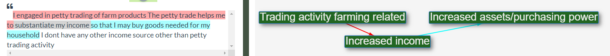

# What is the causal map app?

It's a new online tool for social science researchers and programme evaluators.

A way to code, analyse and visualise fragments of information about what causes what.

# Who can use the causal map app?

Right now, we're in a pre-alpha testing stage. Contact us if you are interested: steve@pogol.net.

# Who is behind the causal map app?

- Fiona! 

- James! 

- Steve!

# How much will it cost?

You'll be able to make and edit your own causal maps for free. If you want extra toppings, like private projects, there'll probably be a monthly subscription.

# What is the theory behind it?

## How does the causal map app differ from other software?

It facilitates the process of reading in narrative data from different sources, e.g. interviewees, identifying fragments of causal information within them, 
and then amalgamating / aggregating the information to create a causal network diagram, while not losing the information about the sources. 
So it is possible to, for example, display only the information from the female respondents. 

## Papers

